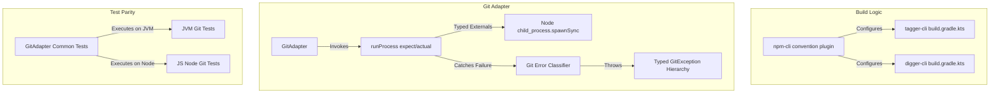

# Requirements

### Overview & Goals
The objective is to execute a comprehensive refactoring across the CLI packaging infrastructure, Node.js runtime interop, multiplatform testing, domain error handling, and help resource resolution in the repository (`tagger-cli`, `digger-cli`, `tools/git-adapter`, and `tools/cli-tools`). These refactorings maximize codebase maintainability, type safety, test confidence across JS and JVM targets, and developer productivity while preserving full backward compatibility and existing CLI utility.

### Scope
- **In Scope**:
  1. **NPM CLI Packaging Convention Plugin**: Extract shared Gradle DSL in `tools-plugins` for NPM packaging (`package.json` generation, license copying, tarball archiving, and provenance publishing).
  2. **Strongly-Typed Node.js Interop in `git-adapter`**: Standardize Kotlin external declarations for Node's `child_process` and `process` in `RunProcess.js.kt`, eliminating untyped `dynamic` and raw inline JS calls.
  3. **Multiplatform Test Parity for `git-adapter`**: Port or expand `GitAdapter` integration tests to run on both JS (Node.js) and JVM targets, verifying Git commands in real repositories under both runtimes.
  4. **Rich Domain Errors in `git-adapter`**: Introduce typed domain exceptions (`GitRepositoryNotFoundError`, `GitTagAlreadyExistsError`, `GitInvalidRefError`, etc.) parsed from Git process exit codes and stderr.
  5. **Unified CLI Help & Resource Discovery**: Consolidate resource bundling and path resolution between `tagger-cli` and `digger-cli` via `cli-tools`.
- **Out of Scope**:
  - Changing public CLI flags, arguments, or JSON output schemas for `tagger` or `digger`.
  - Introducing third-party Git client libraries (maintaining direct non-shell Git CLI execution).

### User Stories
- **As a developer / maintainer**, I want shared Gradle convention plugins for CLI packaging so that adding or maintaining CLI tools requires minimal boilerplate and guarantees consistent provenance, licensing, and metadata configuration.
- **As a multiplatform developer**, I want `git-adapter` to be tested identically across JVM and JS Node runtimes so that platform-specific regressions are caught immediately in CI.
- **As a CLI user / integrator**, I want clear, typed domain errors when Git operations fail rather than raw generic process exit codes.

### Functional & Quality Improvements
- **Maintainability**: Centralize ~300 lines of duplicated Gradle packaging and publishing code.
- **Type Safety**: Replace dynamic JS interop with explicit Kotlin external interfaces.
- **Reliability**: Dual-target CI test coverage for all core GitAdapter workflows.
- **Actionable Diagnostics**: Clear, domain-oriented error messages on common Git operational failures.

# Technical Design

### Current Implementation
- `command-line-tools/tagger-cli/build.gradle.kts` and `command-line-tools/digger-cli/build.gradle.kts` duplicate tasks for `copyLicense`, `copyReadme`, `jsCliTar`, `jsPublish`, `confirmJs<Cli>CanRun`, and `packageJson` synthesis.
- `tools/git-adapter/src/jsMain/kotlin/.../RunProcess.js.kt` uses `dynamic` for `childProcess` and raw `js("Object.assign({}, process.env, envJson)")`.
- `GitAdapterTest` runs only on the JVM using `@TempDir File`, leaving `GitAdapter` higher-level operations unverified on Node.js in CI.
- Process execution failures in `GitAdapter` throw generic `ProcessError` without semantic classification of Git failures.
- Guide resource copying and loading are configured separately in both CLI modules with individual `copyGuideResources` tasks.

### Key Decisions
1. **Shared Gradle Convention Plugin (`com.zegreatrob.tools.plugins.npm-cli`)**:
   - Define convention plugin in `tools-plugins` providing an extension for CLI packaging configuration (package name, description, binary name, keywords, directory).
   - Standardize `copyLicense`, `copyReadme`, `jsCliTar`, and `jsPublish` task wiring with automatic provenance and snapshot detection.
2. **Strong Kotlin JS Externals**:
   - Define typed external interfaces (`NodeChildProcess`, `SpawnSyncOptions`, `SpawnSyncOutput`, `NodeProcessEnv`) in `git-adapter/src/jsMain`.
   - Use standard Kotlin JS object construction (`jsObject<SpawnSyncOptions>`) instead of untyped `json(...)` and inline `js(...)` snippet execution.
3. **Common Git Multiplatform Test Harness**:
   - Utilize or extend `tools/git-test` to support cross-platform temp directory creation and Git repo initialization on both JVM and JS (Node.js).
   - Move core `GitAdapterTest` scenarios into `commonTest`.
4. **Rich Domain Error Classification**:
   - Create `sealed class GitException(message: String, val command: String, val exitCode: Int)` with specific subclasses: `GitRepositoryNotFoundException`, `GitTagAlreadyExistsException`, `GitInvalidRefException`, `GitCommandExecutionException`.
   - Implement `parseGitError(command: String, exitCode: Int, stderr: String): GitException` in `GitAdapter`.
5. **Consolidated Help Resource Management**:
   - Standardize guide resource copying convention in the CLI plugin and reuse `tools/cli-tools` resource loading across all CLIs.

### Architecture Diagram

### File Structure & Changes
- `tools-plugins/src/main/kotlin/com/zegreatrob/tools/plugins/npm-cli.gradle.kts` (new convention plugin)
- `command-line-tools/tagger-cli/build.gradle.kts` (apply convention plugin, remove duplicate DSL)
- `command-line-tools/digger-cli/build.gradle.kts` (apply convention plugin, remove duplicate DSL)
- `tools/git-adapter/src/jsMain/kotlin/com/zegreatrob/tools/adapter/git/NodeChildProcess.kt` (typed external definitions)
- `tools/git-adapter/src/jsMain/kotlin/com/zegreatrob/tools/adapter/git/RunProcess.js.kt` (refactored to use typed externals)
- `tools/git-adapter/src/commonMain/kotlin/com/zegreatrob/tools/adapter/git/GitException.kt` (domain exception hierarchy)
- `tools/git-adapter/src/commonMain/kotlin/com/zegreatrob/tools/adapter/git/GitAdapter.kt` (integrate error parser)
- `tools/git-adapter/src/commonTest/kotlin/com/zegreatrob/tools/adapter/git/GitAdapterTest.kt` (multiplatform git adapter tests)
- `tools/cli-tools/` & `tools/*-guide/` (consolidated resource discovery)

# Testing

### Validation Approach
Verify all refactored components through comprehensive multiplatform unit tests, Gradle build validation, packaging inspection, and linting checks.

### Key Scenarios
1. **Convention Plugin & Packaging Verification**:
   - Run `./gradlew :command-line-tools:tagger-cli:jsCliTar :command-line-tools:digger-cli:jsCliTar`.
   - Verify generated `.tgz` archives contain identical `package.json`, `LICENSE`, `README.md`, and binaries.
2. **Node.js Typed Interop**:
   - Run `./gradlew :tools:git-adapter:jsNodeTest`.
   - Verify process execution, error propagation, and environment variable passing function identically with typed externals.
3. **Multiplatform Git Test Parity**:
   - Run `./gradlew :tools:git-adapter:allTests` to ensure GitAdapter scenarios pass on both JVM and JS Node test runners.
4. **Domain Error Classification**:
   - Test non-git directories, duplicate tags, and nonexistent refs to ensure expected typed `GitException` subclasses are thrown with clear diagnostic messages.
5. **Full Repository Sanity**:
   - Run `./gradlew check -q --console=plain` across the monorepo to ensure 0 lint or build regressions.

# Delivery Steps

### ✓ Step 1: Extract shared Gradle convention plugin for NPM CLI packaging
Centralize NPM packaging, metadata synthesis, licensing, and publication tasks into a shared Gradle convention plugin.

- Create `tools-plugins/src/main/kotlin/com/zegreatrob/tools/plugins/npm-cli.gradle.kts` encapsulating `packageJson` synthesis, `copyLicense`, `copyReadme`, `jsCliTar`, and `jsPublish` tasks.
- Define a project extension to configure module-specific properties (name, description, binary name, keywords, directory).
- Refactor `command-line-tools/tagger-cli/build.gradle.kts` and `command-line-tools/digger-cli/build.gradle.kts` to apply the convention plugin, removing duplicated packaging boilerplate.
- Validate that generated tarballs and `package.json` files remain byte-equivalent in structure and content.

### ✓ Step 2: Standardize Node.js interop and types in git-adapter
Replace dynamic JavaScript interop in `RunProcess.js.kt` with strongly-typed Kotlin external declarations.

- Create strongly-typed external interfaces for Node `child_process` (`SpawnSyncOptions`, `SpawnSyncReturns`) and Node `process.env`.
- Refactor `tools/git-adapter/src/jsMain/kotlin/com/zegreatrob/tools/adapter/git/RunProcess.js.kt` to eliminate untyped `dynamic` and raw inline JS `Object.assign` calls.
- Retain strict `shell: false`, `windowsHide: true`, and precondition validation.
- Verify existing Node.js tests in `RunProcessJsTest` pass cleanly with zero lint warnings.

### ✓ Step 3: Expand multiplatform test parity for git-adapter
Enable comprehensive GitAdapter integration testing across both JS Node and JVM platforms.

- Enhance `tools/git-test` to provide multiplatform repository creation and temporary directory utilities compatible with both JVM and JS environments.
- Move `GitAdapterTest` from `tools/git-adapter/src/jvmTest` into `commonTest` so operations like tagging, listing tags, and log parsing run against real Git repos under both Node.js and JVM.
- Validate test execution using `./gradlew :tools:git-adapter:allTests`.

### ✓ Step 4: Implement rich domain exceptions in GitAdapter
Introduce structured, typed domain exceptions for Git operational failures with helpful diagnostic messages.

- Define a typed `GitException` class hierarchy (`GitRepositoryNotFoundException`, `GitTagAlreadyExistsException`, `GitInvalidRefException`, `GitUncommittedChangesException`, `GitCommandExecutionException`) in `tools/git-adapter/src/commonMain`.
- Add an error classification parser in `GitAdapter` that maps Git exit codes and standard error patterns to typed domain exceptions.
- Add unit tests in `commonTest` covering each failure category and error message formatting.

### ✓ Step 5: Consolidate CLI help and resource resolution
Unify help and markdown resource bundling and runtime resolution across all CLI modules.

- Standardize guide resource copying and bundling tasks within the build convention plugin.
- Streamline resource resolution in `tools/cli-tools` to ensure consistent and robust loading across test fixtures, dev links, and packaged distributions.
- Verify `HelpFromDifferentDirectoryTest` passes for both `tagger-cli` and `digger-cli`.